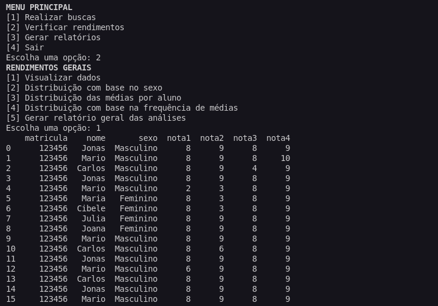

# Gerenciador de Notas


Esse projeto tem como objetivo criar um gerenciador de notas, onde o usuário, ao inserir uma base de dados, pode realizar consultas e gerar relatórios.

## Requisitos
Para esse projeto é necessário instalar as seguintes bibliotecas:
- pandas
- matplotlib
- openpyxl
```
pip install pandas
pip install matplotlib
pip install openpyxl
```
## Funcionalidades
- Realizar buscas na base de dados
- Consultar análises gráficas dos dados presentes na tabela
- Gerar relatórios em diversos formatos

## Como usar
Para utilizar o gerenciador de notas, basta seguir os passos abaixo:
1. Insira a base de dados na pasta "sua_planilha"
2. Execute o arquivo "main.py"
3. Siga as instruções do programa
4. Pronto! Você já pode realizar consultas e gerar relatórios

OBS.: Segue link do modelo de planilha a ser utilizado: [Planlinha](https://docs.google.com/spreadsheets/d/1prlB-YISPB7u0ZzkzhEZgH4iDrX_KMCRkGkM6kcFts0/edit?usp=sharing)

## Autores
- [Ítalo Gustavo](https://github.com/Yta-ux)
- [Camila Freitas](https://github.com/CamilaFB)
- [Daniel Mendes](https://github.com/daniel23github)
